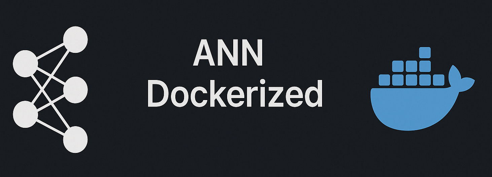

<div align="center">
    
</div>

<div align="center">
  <h1>MNIST Digit Recognition using Artificial Neural Networks</h1>
</div>

# Table of Contents 
<div>
  &nbsp;&nbsp;&nbsp;&nbsp;<a href="#1-project-overview"><i><b>1. Project Overview</b></i></a>
</div>
&nbsp;

<div>
  &nbsp;&nbsp;&nbsp;&nbsp;<a href="#2-educational-objectives"><i><b>2. Educational Objectives</b></i></a>
</div>
&nbsp;

<div>
  &nbsp;&nbsp;&nbsp;&nbsp;<a href="#3-prerequisites"><i><b>3. Prerequisites</b></i></a>
</div>
&nbsp;

<div>
  &nbsp;&nbsp;&nbsp;&nbsp;<a href="#4-project-structure"><i><b>4. Project Structure</b></i></a>
</div>
&nbsp;

<details>
  <summary><a href="#5-getting-started"><i><b>5. Getting Started</b></i></a></summary>
  <div>
    &nbsp;&nbsp;&nbsp;&nbsp;&nbsp;&nbsp;&nbsp;&nbsp;&nbsp;&nbsp;<a href="#51-clone-the-repository">5.1. Clone the Repository</a><br>
    &nbsp;&nbsp;&nbsp;&nbsp;&nbsp;&nbsp;&nbsp;&nbsp;&nbsp;&nbsp;<a href="#52-start-the-docker-container">5.2. Start the Docker Container</a><br>
    &nbsp;&nbsp;&nbsp;&nbsp;&nbsp;&nbsp;&nbsp;&nbsp;&nbsp;&nbsp;<a href="#53-access-jupyter-notebook">5.3. Access Jupyter Notebook</a><br>
  </div>
</details>
&nbsp;

<details>
  <summary><a href="#6-project-components"><i><b>6. Project Components</b></i></a></summary>
  <div>
    &nbsp;&nbsp;&nbsp;&nbsp;&nbsp;&nbsp;&nbsp;&nbsp;&nbsp;&nbsp;<a href="#61-data-preparation">6.1. Data Preparation</a><br>
    &nbsp;&nbsp;&nbsp;&nbsp;&nbsp;&nbsp;&nbsp;&nbsp;&nbsp;&nbsp;<a href="#62-neural-network-architecture">6.2. Neural Network Architecture</a><br>
    &nbsp;&nbsp;&nbsp;&nbsp;&nbsp;&nbsp;&nbsp;&nbsp;&nbsp;&nbsp;<a href="#63-training-process">6.3. Training Process</a><br>
    &nbsp;&nbsp;&nbsp;&nbsp;&nbsp;&nbsp;&nbsp;&nbsp;&nbsp;&nbsp;<a href="#64-evaluation-and-visualization">6.4. Evaluation and Visualization</a><br>
  </div>
</details>
&nbsp;

<div>
  &nbsp;&nbsp;&nbsp;&nbsp;<a href="#7-learning-exercises-for-students"><i><b>7. Learning Exercises for Students</b></i></a>
</div>
&nbsp;

<details>
  <summary><a href="#8-common-issues-and-solutions"><i><b>8. Common Issues and Solutions</b></i></a></summary>
  <div>
    &nbsp;&nbsp;&nbsp;&nbsp;&nbsp;&nbsp;&nbsp;&nbsp;&nbsp;&nbsp;<a href="#81-docker-container-issues">8.1. Docker Container Issues</a><br>
    &nbsp;&nbsp;&nbsp;&nbsp;&nbsp;&nbsp;&nbsp;&nbsp;&nbsp;&nbsp;<a href="#82-training-issues">8.2. Training Issues</a><br>
  </div>
</details>
&nbsp;

<div>
  &nbsp;&nbsp;&nbsp;&nbsp;<a href="#9-resources-for-further-learning"><i><b>9. Resources for Further Learning</b></i></a>
</div>
&nbsp;

<div>
  &nbsp;&nbsp;&nbsp;&nbsp;<a href="#10-license"><i><b>10. License</b></i></a>
</div>
&nbsp;

# 1. Project Overview

This project implements an Artificial Neural Network (ANN) to recognize handwritten digits from the MNIST dataset. The entire project is containerized using Docker for easy setup and reproducibility, making it an ideal learning environment for students exploring machine learning fundamentals.

The MNIST dataset is a collection of 70,000 grayscale images of handwritten digits (0-9), widely considered the "Hello World" of machine learning. Our implementation achieves approximately 98% accuracy using a straightforward feedforward neural network architecture.

# 2. Educational Objectives

Through this project, students will learn:

- **Machine Learning Fundamentals**: Understanding data preprocessing, model training, evaluation metrics, and visualization techniques
- **Neural Network Architecture**: Designing multi-layer feedforward networks with appropriate activation functions
- **Regularization Techniques**: Implementing dropout to prevent overfitting
- **Docker Containerization**: Working with isolated, reproducible development environments
- **Data Visualization**: Creating meaningful visualizations to understand model performance
- **Python Best Practices**: Organizing code, documentation, and project structure

# 3. Prerequisites

- Docker and Docker Compose installed on your system
- Git for cloning the repository
- Basic understanding of Python and machine learning concepts

No Python or ML libraries need to be installed locally, as everything runs within the Docker container, thus eliminating compatibility issues across different operating systems and environments.

# 4. Project Structure

```
.
+---Dockerfile                <-- Docker configuration for environment setup
+---docker-compose.yml        <-- Docker Compose configuration for service definition
+---requirements.txt          <-- Python dependencies for the project
+---start.sh                  <-- Startup script for Docker container
|
+---data/                     <-- Data directory
|   +---mnist/                <-- Raw and processed MNIST data (generated at runtime)
|   +---mnist_samples/        <-- Sample images extracted from MNIST for visualization
|   +---README.md             <-- Documentation for the dataset
|
+---figures/                  <-- Visualizations and plots
|   +---mnist_samples.png     <-- Grid of sample MNIST digits
|   +---confusion_matrix.png  <-- Model performance visualization
|   +---training_history.png  <-- Training/validation metrics over time
|   +---prediction_samples.png <-- Examples of model predictions
|   +---README.md             <-- Documentation for visualizations
|
+---notebooks/                <-- Jupyter notebooks for interactive learning
|   +---01_data_preparation.ipynb  <-- Data loading, exploration and preparation
|   +---02_model_training.ipynb    <-- Model building, training and evaluation
|   +---README.md             <-- Documentation for notebooks
|
+---models/                   <-- Saved model files
|   +---mnist_ann_best.h5     <-- Best model based on validation accuracy
|   +---mnist_ann_final.h5    <-- Final trained model
|   +---README.md             <-- Documentation for models
|
+---scripts/                  <-- Python scripts
    +---data_prep.py          <-- Download and preprocess MNIST data
    +---extract_sample_images.py <-- Extract sample images for visualization
    +---train_ann.py          <-- Train the ANN model
    +---README.md             <-- Documentation for scripts
```

# 5. Getting Started

## 5.1. Clone the Repository

```bash
git clone <repository-url>
cd ANN_MNIST_Dockerized
```

## 5.2. Start the Docker Container

```bash
# Start the container in detached mode
./start.sh

# Alternatively, use Docker Compose directly
docker-compose up --build -d
```

## 5.3. Access Jupyter Notebook

Open your browser and navigate to:

```
http://localhost:8888
```

This will open Jupyter Notebook where you can run the interactive notebooks:
- `01_data_preparation.ipynb` - Explore and prepare the MNIST dataset
- `02_model_training.ipynb` - Build, train, and evaluate the neural network model

# 6. Project Components

## 6.1. Data Preparation

The MNIST dataset consists of 28×28 pixel grayscale images of handwritten digits. The data preparation process includes:

1. **Downloading**: Automatic download using TensorFlow's dataset API
2. **Normalization**: Scaling pixel values from [0-255] to [0-1] for better training
3. **Reshaping**: Flattening 28×28 images into 784-length vectors for input to the neural network
4. **Train-Test Split**: Using the standard 60,000 training and 10,000 test images

To prepare the data, run the `01_data_preparation.ipynb` notebook or:

```bash
# Inside the Docker container
python scripts/data_prep.py
```

## 6.2. Neural Network Architecture

Our model uses a feedforward neural network with:

1. **Input Layer**: 784 neurons (one for each pixel in the flattened image)
2. **Hidden Layers**:
   - First hidden layer: 512 neurons with ReLU activation
   - Second hidden layer: 256 neurons with ReLU activation
   - Third hidden layer: 128 neurons with ReLU activation
3. **Dropout Layers**: Added after each hidden layer (rates: 0.2, 0.3, 0.4) to prevent overfitting
4. **Output Layer**: 10 neurons with softmax activation (probability distribution over digits 0-9)

## 6.3. Training Process

The model is trained using:

1. **Optimizer**: Adam optimizer with default learning rate
2. **Loss Function**: Categorical cross-entropy (standard for multi-class classification)
3. **Batch Size**: 128 samples per gradient update
4. **Early Stopping**: Training stops when validation loss stops improving (patience=10)
5. **Model Checkpointing**: Saves the best model based on validation accuracy

To train the model, run the `02_model_training.ipynb` notebook or:

```bash
# Inside the Docker container
python scripts/train_ann.py
```

## 6.4. Evaluation and Visualization

The model evaluation produces:

1. **Confusion Matrix**: Shows correct and incorrect classifications for each digit
2. **Classification Report**: Detailed metrics including precision, recall, and F1-score
3. **Training History**: Plots showing accuracy and loss during training
4. **Sample Predictions**: Visualization of correctly and incorrectly classified digits

# 7. Learning Exercises for Students

1. **Modify the Network Architecture**:
   - Add or remove hidden layers
   - Change the number of neurons in each layer
   - Experiment with different activation functions (sigmoid, tanh, leaky ReLU)

2. **Tune Hyperparameters**:
   - Try different optimizers (SGD, RMSprop)
   - Modify learning rates
   - Adjust dropout rates
   - Change batch sizes and number of epochs

3. **Implement Data Augmentation**:
   - Add rotation, translation, or scaling to training images
   - Create a data generator for augmentation

4. **Compare with Other Models**:
   - Implement a Convolutional Neural Network (CNN)
   - Try a simpler model like Logistic Regression
   - Compare performance metrics across different approaches

5. **Visualization Improvements**:
   - Create t-SNE visualizations of feature spaces
   - Generate class activation maps
   - Visualize neuron activations for different digits

# 8. Common Issues and Solutions

## 8.1. Docker Container Issues

- **Port Already in Use**: If you see an error about port 8888 being already in use, change the port mapping in docker-compose.yml from "8888:8888" to another port like "8889:8888".
- **Container Not Starting**: Ensure Docker service is running on your machine.
- **Memory Issues**: Increase memory allocation for Docker in the settings if the model training is too slow.

## 8.2. Training Issues

- **Low Accuracy**: Check normalization of input data and model architecture.
- **Overfitting**: Increase dropout rates or add L1/L2 regularization.
- **Slow Training**: Reduce batch size or simplify the model architecture.

# 9. Resources for Further Learning

- [TensorFlow Documentation](https://www.tensorflow.org/tutorials/keras/classification)
- [Neural Networks and Deep Learning by Michael Nielsen](http://neuralnetworksanddeeplearning.com/)
- [Deep Learning Book by Ian Goodfellow, Yoshua Bengio, and Aaron Courville](https://www.deeplearningbook.org/)
- [Kaggle MNIST Competitions](https://www.kaggle.com/c/digit-recognizer)

# 10. License

This project is licensed under the terms of the LICENSE file included in the repository.