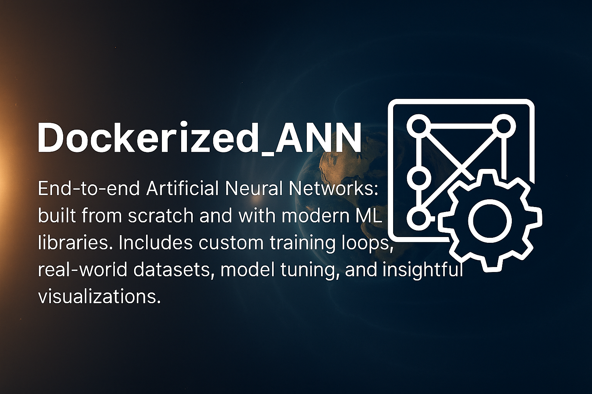

<div align="center">
    
</div>

<div align="center">
  <h1>Handwritten Digit Recognition with Artificial Neural Networks using MNIST Dataset</h1>
</div>

# Table of Contents 
<div>
  &nbsp;&nbsp;&nbsp;&nbsp;<a href="#1-project-overview"><i><b>1. Project Overview</b></i></a>
</div>
&nbsp;

<div>
  &nbsp;&nbsp;&nbsp;&nbsp;<a href="#2-educational-objectives"><i><b>2. Educational Objectives</b></i></a>
</div>
&nbsp;

<div>
  &nbsp;&nbsp;&nbsp;&nbsp;<a href="#3-prerequisites"><i><b>3. Prerequisites</b></i></a>
</div>
&nbsp;

<div>
  &nbsp;&nbsp;&nbsp;&nbsp;<a href="#4-project-structure"><i><b>4. Project Structure</b></i></a>
</div>
&nbsp;

<details>
  <summary><a href="#5-getting-started"><i><b>5. Getting Started</b></i></a></summary>
  <div>
    &nbsp;&nbsp;&nbsp;&nbsp;&nbsp;&nbsp;&nbsp;&nbsp;&nbsp;&nbsp;<a href="#51-clone-the-repository">5.1. Clone the Repository</a><br>
    &nbsp;&nbsp;&nbsp;&nbsp;&nbsp;&nbsp;&nbsp;&nbsp;&nbsp;&nbsp;<a href="#52-start-the-docker-container">5.2. Start the Docker Container</a><br>
    &nbsp;&nbsp;&nbsp;&nbsp;&nbsp;&nbsp;&nbsp;&nbsp;&nbsp;&nbsp;<a href="#53-access-jupyter-notebook">5.3. Access Jupyter Notebook</a><br>
  </div>
</details>
&nbsp;

<details>
  <summary><a href="#6-project-components"><i><b>6. Project Components</b></i></a></summary>
  <div>
    &nbsp;&nbsp;&nbsp;&nbsp;&nbsp;&nbsp;&nbsp;&nbsp;&nbsp;&nbsp;<a href="#61-data-preparation">6.1. Data Preparation</a><br>
    &nbsp;&nbsp;&nbsp;&nbsp;&nbsp;&nbsp;&nbsp;&nbsp;&nbsp;&nbsp;<a href="#62-neural-network-architecture">6.2. Neural Network Architecture</a><br>
    &nbsp;&nbsp;&nbsp;&nbsp;&nbsp;&nbsp;&nbsp;&nbsp;&nbsp;&nbsp;<a href="#63-training-process">6.3. Training Process</a><br>
    &nbsp;&nbsp;&nbsp;&nbsp;&nbsp;&nbsp;&nbsp;&nbsp;&nbsp;&nbsp;<a href="#64-evaluation-and-visualization">6.4. Evaluation and Visualization</a><br>
  </div>
</details>
&nbsp;

<div>
  &nbsp;&nbsp;&nbsp;&nbsp;<a href="#7-learning-exercises-for-students"><i><b>7. Learning Exercises for Students</b></i></a>
</div>
&nbsp;

<details>
  <summary><a href="#8-common-issues-and-solutions"><i><b>8. Common Issues and Solutions</b></i></a></summary>
  <div>
    &nbsp;&nbsp;&nbsp;&nbsp;&nbsp;&nbsp;&nbsp;&nbsp;&nbsp;&nbsp;<a href="#81-docker-container-issues">8.1. Docker Container Issues</a><br>
    &nbsp;&nbsp;&nbsp;&nbsp;&nbsp;&nbsp;&nbsp;&nbsp;&nbsp;&nbsp;<a href="#82-training-issues">8.2. Training Issues</a><br>
  </div>
</details>
&nbsp;

<div>
  &nbsp;&nbsp;&nbsp;&nbsp;<a href="#9-resources-for-further-learning"><i><b>9. Resources for Further Learning</b></i></a>
</div>
&nbsp;

<div>
  &nbsp;&nbsp;&nbsp;&nbsp;<a href="#10-license"><i><b>10. License</b></i></a>
</div>
&nbsp;

# 1. Project Overview

This repository contains an implementation of an Artificial Neural Network (ANN) designed to classify handwritten digits from the MNIST dataset. The entire solution is packaged within Docker containers to ensure consistent setup and reproducibility, creating an excellent educational environment for those studying the fundamentals of machine learning.

The MNIST dataset comprises 70,000 grayscale images of handwritten digits (ranging from 0 to 9) and is often referred to as the "Hello World" of machine learning. Our neural network implementation achieves roughly 98% accuracy using a standard feedforward neural network design.

# 2. Educational Objectives

This project helps students gain knowledge in:

- **Machine Learning Fundamentals**: Exploring data preprocessing techniques, model training methodologies, evaluation metrics, and data visualization approaches
- **Neural Network Architecture**: Creating multi-layer feedforward networks and selecting appropriate activation functions
- **Regularization Techniques**: Applying dropout layers to combat overfitting
- **Docker Containerization**: Utilizing isolated, reproducible environments for development
- **Data Visualization**: Generating informative visualizations to interpret model performance
- **Python Best Practices**: Structuring code, writing documentation, and organizing project components

# 3. Prerequisites

- Docker and Docker Compose installed on your computer
- Git installed for repository cloning
- Fundamental understanding of Python programming and machine learning concepts

There's no need to install Python or any machine learning libraries on your local system since everything runs within the Docker container, eliminating compatibility issues across different platforms and environments.

# 4. Project Structure

```
.
+---Dockerfile                <-- Docker configuration for environment setup
+---docker-compose.yml        <-- Docker Compose configuration for service definition
+---requirements.txt          <-- Python dependencies for the project
+---start.sh                  <-- Startup script for Docker container
|
+---data/                     <-- Data directory
|   +---mnist/                <-- Raw and processed MNIST data (generated at runtime)
|   +---mnist_samples/        <-- Sample images extracted from MNIST for visualization
|   +---README.md             <-- Documentation for the dataset
|
+---figures/                  <-- Visualizations and plots
|   +---mnist_samples.png     <-- Grid of sample MNIST digits
|   +---confusion_matrix.png  <-- Model performance visualization
|   +---training_history.png  <-- Training/validation metrics over time
|   +---prediction_samples.png <-- Examples of model predictions
|   +---README.md             <-- Documentation for visualizations
|
+---notebooks/                <-- Jupyter notebooks for interactive learning
|   +---01_data_preparation.ipynb  <-- Data loading, exploration and preparation
|   +---02_model_training.ipynb    <-- Model building, training and evaluation
|   +---README.md             <-- Documentation for notebooks
|
+---models/                   <-- Saved model files
|   +---mnist_ann_best.h5     <-- Best model based on validation accuracy
|   +---mnist_ann_final.h5    <-- Final trained model
|   +---README.md             <-- Documentation for models
|
+---scripts/                  <-- Python scripts
    +---data_prep.py          <-- Download and preprocess MNIST data
    +---extract_sample_images.py <-- Extract sample images for visualization
    +---train_ann.py          <-- Train the ANN model
    +---README.md             <-- Documentation for scripts
```

# 5. Getting Started

## 5.1. Clone the Repository

```bash
git clone <repository-url>
cd ANN_MNIST_Dockerized
```

## 5.2. Start the Docker Container

```bash
# Start the container in detached mode
./start.sh

# Alternatively, use Docker Compose directly
docker-compose up --build -d
```

## 5.3. Access Jupyter Notebook

Launch your web browser and navigate to:

```
http://localhost:8888
```

This will open the Jupyter Notebook interface where you can access and run the interactive notebooks:
- `01_data_preparation.ipynb` - For exploring and preparing the MNIST dataset
- `02_model_training.ipynb` - For constructing, training, and evaluating the neural network model

# 6. Project Components

## 6.1. Data Preparation

The MNIST dataset consists of 28×28 pixel grayscale images representing handwritten digits. The data preparation workflow includes:

1. **Downloading**: Automatically retrieving the dataset using TensorFlow's dataset API
2. **Normalization**: Converting pixel values from the range [0-255] to [0-1] to improve training efficiency
3. **Reshaping**: Converting 28×28 images into 784-element vectors for neural network input
4. **Train-Test Split**: Utilizing the standard division of 60,000 training images and 10,000 test images

To prepare the dataset, execute the `01_data_preparation.ipynb` notebook or run:

```bash
# Inside the Docker container
python scripts/data_prep.py
```

## 6.2. Neural Network Architecture

Our implementation uses a feedforward neural network with the following structure:

1. **Input Layer**: 784 neurons (corresponding to each pixel in the flattened image)
2. **Hidden Layers**:
   - First hidden layer: 512 neurons with ReLU activation
   - Second hidden layer: 256 neurons with ReLU activation
   - Third hidden layer: 128 neurons with ReLU activation
3. **Dropout Layers**: Implemented after each hidden layer (with rates of 0.2, 0.3, and 0.4) to reduce overfitting
4. **Output Layer**: 10 neurons with softmax activation (representing probability distribution across digits 0-9)

## 6.3. Training Process

The neural network is trained with the following parameters:

1. **Optimizer**: Adam optimizer utilizing the default learning rate
2. **Loss Function**: Categorical cross-entropy (the standard choice for multi-class classification)
3. **Batch Size**: 128 examples per gradient update
4. **Early Stopping**: Training terminates when validation loss no longer improves (with patience=10)
5. **Model Checkpointing**: The best-performing model based on validation accuracy is saved

To train the model, run the `02_model_training.ipynb` notebook or execute:

```bash
# Inside the Docker container
python scripts/train_ann.py
```

## 6.4. Evaluation and Visualization

The model evaluation generates:

1. **Confusion Matrix**: Displaying the distribution of correct and incorrect classifications for each digit
2. **Classification Report**: Providing detailed metrics including precision, recall, and F1-score
3. **Training History**: Charts illustrating accuracy and loss progression during the training process
4. **Sample Predictions**: Visual examples of correctly and incorrectly classified digits

# 7. Learning Exercises for Students

1. **Modify the Network Architecture**:
   - Experiment with adding or removing hidden layers
   - Adjust the number of neurons in different layers
   - Test various activation functions (sigmoid, tanh, leaky ReLU)

2. **Tune Hyperparameters**:
   - Experiment with alternative optimizers (SGD, RMSprop)
   - Adjust the learning rate values
   - Modify dropout rates
   - Vary batch sizes and training epochs

3. **Implement Data Augmentation**:
   - Incorporate rotation, translation, or scaling to training images
   - Develop a data generator for performing augmentation

4. **Compare with Other Models**:
   - Develop a Convolutional Neural Network (CNN) implementation
   - Test simpler approaches like Logistic Regression
   - Compare performance metrics across different model architectures

5. **Visualization Improvements**:
   - Generate t-SNE visualizations of feature spaces
   - Create class activation maps
   - Visualize individual neuron activations for different input digits

# 8. Common Issues and Solutions

## 8.1. Docker Container Issues

- **Port Already in Use**: If you encounter an error indicating port 8888 is already occupied, modify the port mapping in docker-compose.yml from "8888:8888" to an alternative port such as "8889:8888".
- **Container Not Starting**: Verify that the Docker service is running on your system.
- **Memory Issues**: If model training proceeds too slowly, increase the memory allocation for Docker in the settings.

## 8.2. Training Issues

- **Low Accuracy**: Examine the input data normalization and review the model architecture.
- **Overfitting**: Try increasing dropout rates or implementing L1/L2 regularization.
- **Slow Training**: Consider reducing the batch size or simplifying the network architecture.

# 9. Resources for Further Learning

- [TensorFlow Documentation](https://www.tensorflow.org/tutorials/keras/classification)
- [Neural Networks and Deep Learning by Michael Nielsen](http://neuralnetworksanddeeplearning.com/)
- [Deep Learning Book by Ian Goodfellow, Yoshua Bengio, and Aaron Courville](https://www.deeplearningbook.org/)
- [Kaggle MNIST Competitions](https://www.kaggle.com/c/digit-recognizer)

# 10. License

This project is made available under the terms specified in the LICENSE file included within this repository.
